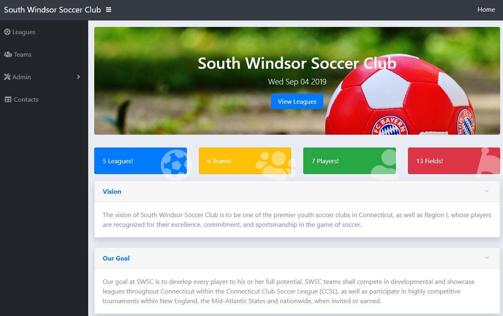

# MEAN-Week1
MEAN application using express generator.



## Install Express generator Module
```
$ npm install express-generator -g
```
## Generate the App
```
$ cd A_WORKING_DIR_OF_YOUR_CHOIDE

$ express --view=hbs usermanagement

$ cd usermanagement
$ npm install
npm notice created a lockfile as package-lock.json. You should commit this file.
added 83 packages in 5.319s

$ npm start

```

### Launch App
- Home [http://localhost:3000/](http://localhost:3000/) in your browser
- goto login page and enter the username:FooBar and password:password123
- Register  [http://localhost:3000/users/register](http://localhost:3000/users/register) 
- Leagues  [http://localhost:3000/leagues](http://localhost:3000/leagues) 


### Postman Collections
- Please refere postman collections located in folder (usermanagement/postman_collections)


## Useful link(s)
* [Express Generator](https://expressjs.com/en/starter/generator.html)
